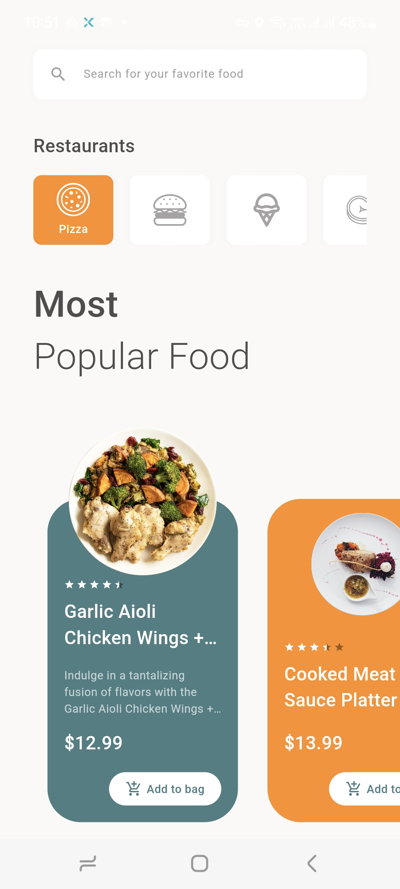
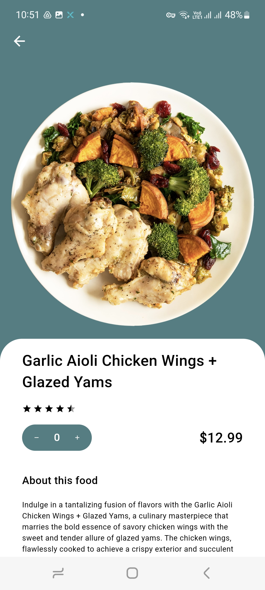
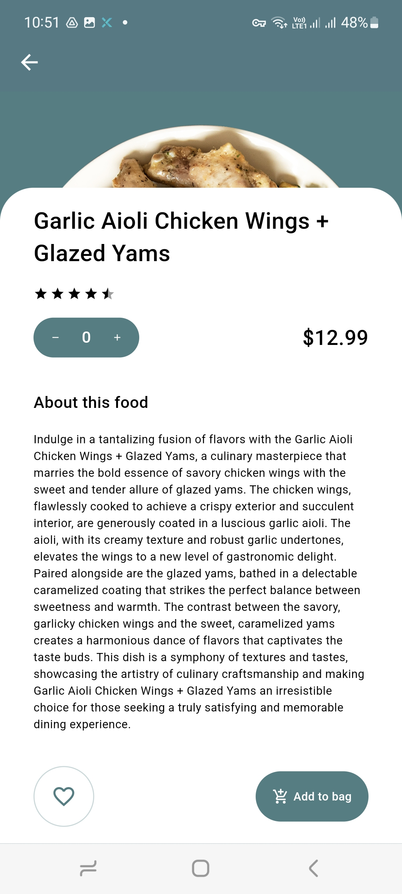

# NomNom - Food Selling UI Challenge

  
  
  

NomNom is a food selling UI challenge, that uses animations and transform effects to implement a dynamic and attractive UI

## License

This project is licensed under the [MIT License](LICENSE).
